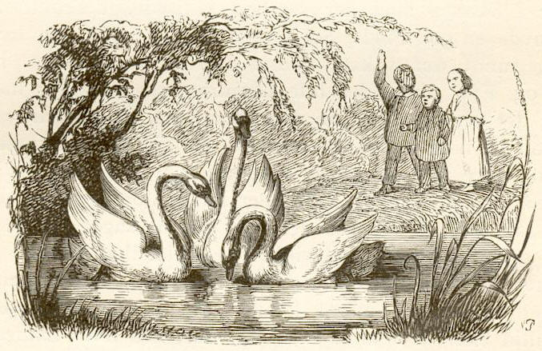

---
# Feel free to add content and custom Front Matter to this file.
# To modify the layout, see https://jekyllrb.com/docs/themes/#overriding-theme-defaults

layout: home
---

# 𝛼Haf – Algorithmic Fairness Copenhagen 

Researchers and students in the Copenhagen area interested in fairness, accountability, and transparency aspects of algorithmic decision processes. Everyone is welcome.

## People

- Martin Aumüller
- Denise Warncke Hansen
- Inge Li Gørtz
- Josephine Honore
- Natalie Schluter
- Teresa Steiner
- Thore Husfeldt
- Troels Bjerre Lund

## Reading Group

See [Reading group](./readinggroup2019/).

## Events

- Tuesday, 5 Feb 2019, 15:00–16:00. Denise and Josephine present: Friedler et al., A comparative study of fairness-enhancing interventions in machine learning, FAT\* '19 Proceedings of the Conference on Fairness, Accountability, and Transparency. Pages 329-338 Atlanta, GA, USA — January 29 - 31, 2019. [arxiv:1802.04422](https://arxiv.org/abs/1802.04422)

- 29–31 January 2019: ACM FAT\* 2019 conference takes place in Atlanta, GA (USA). Livestream is at [https://fatconference.org/2019/livestream.html](https://fatconference.org/2019/livestream.html) (Copenhagen is six hours ahead of Atlanta)

- 22 November 2018: Thore Husfeldt, [A Glimpse of Algorithmic Fairness](https://thorehusfeldt.com/2018/11/23/a-glimpse-of-algorithmic-fairness/), workshop presentation at [Ethical, legal & social consequences of artificial intelligence](http://aiml.lu.se/events/?event=ethical-legal-social-consequences-of-artificial-intelligence-aimllu-workshop), Network for Artificial Intelligence and Machine Learning at Lund University (AIML@LU), Lund University, 22 November 2018.
